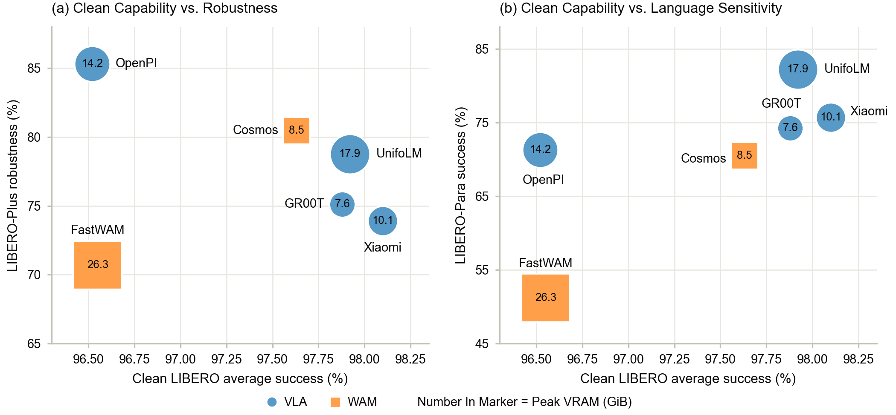

<div align="center">

<h1>IndustrialVLA-Bench</h1>
<h3>An Official-First Benchmark for Open Robot Policy Models</h3>

<p>
Yiqi Wang, Zhifeng Rao, Jiaqi Zhang, Zhangkai Wu, Xiaoyang Li,<br>
Yiqun Duan, Mingkai Zheng, Fei Wang, Shan You, Taotao Cai
</p>

<p>
<a href="https://arxiv.org/abs/XXXX.XXXXX"></a>


</p>

<p><i>Comparable, reproducible, and deployment-aware evaluation of open<br>
Vision-Language-Action (VLA) and World-Action Models (WAMs).</i></p>

</div>

---

## News

- **[2026-07]** Paper *"IndustrialVLA-Bench: An Official-First Benchmark for Open Robot Policy Models"* released on [arXiv](https://arxiv.org/abs/XXXX.XXXXX).
- **[2026-07]** Reproducible experiment archive released: raw logs, per-seed results, latency benchmarks, and standardized launch scripts for all six evaluated models.

## Contents

- [Overview](#overview)
- [Why an Official-First Benchmark?](#why-an-official-first-benchmark)
- [Core Concepts](#core-concepts)
- [Evaluated Models](#evaluated-models)
- [Benchmark Tracks](#benchmark-tracks)
- [Results](#results)
- [Getting Started](#getting-started)
- [Repository Structure](#repository-structure)
- [What Is Not Included](#what-is-not-included)
- [Citation](#citation)
- [Acknowledgements](#acknowledgements)
- [Contact](#contact)

## Overview

<div align="center">

<p><i><b>Figure 1.</b> IndustrialVLA-Bench evaluates open robot policy models through an official-first
harness, organizes evidence into tiers, and reports results along capability, robustness,
language grounding, and deployability axes — each backed by raw logs and traceable metadata.</i></p>
</div>

Open VLA and WAM systems are advancing rapidly, yet their reported results are hard to compare: checkpoints, evaluation protocols, action interfaces, and deployment settings all differ across releases. **IndustrialVLA-Bench** evaluates six publicly executable robot policy models under a single controlled protocol:

- **LIBERO** for clean manipulation capability,
- **LIBERO-Plus** for robustness under controlled perturbations,
- **LIBERO-Para** for sensitivity to paraphrased instructions,
- a **deployability harness** for latency, peak VRAM, runtime mode, and setup burden.

Every configuration is run with three fixed seeds `{1, 7, 42}`, and every reported number is traceable to raw logs, per-seed summaries, and launch commands preserved in this repository.

## Why an Official-First Benchmark?

**1. Fragmented evaluation.** Even within the same benchmark family, results differ because of checkpoints, prompt formats, observation-action interfaces, action normalization, inference scripts, trial counts, and aggregation rules. Apparent gains may reflect evaluation assumptions rather than stronger policies.

**2. Clean success is not reliability.** A model performing well under standard conditions may still fail under changes to cameras, robots, backgrounds, layouts, or instruction wording. Clean success alone cannot distinguish faithful language grounding from memorized layouts and benchmark regularities.

**3. Deployability is rarely reported.** VLA models operate inside robotic execution loops. Inference latency, peak VRAM, runtime architecture, and setup complexity substantially affect practical reuse, yet they are rarely measured consistently.

IndustrialVLA-Bench treats VLA evaluation as a **multi-axis diagnostic and reproducibility problem**, not a single success-rate ranking problem: only official-checkpoint results obtained through official or protocol-faithful evaluation paths are eligible for the main leaderboard, and capability, robustness, language grounding, and deployability are reported as separate evidence views rather than one aggregate score.

## Core Concepts

| Concept | Meaning |
| --- | --- |
| **Official-first execution** | For each model, the official repository, checkpoint, inference path, and evaluation script are prioritized. Wrappers are limited to engineering functions (logging, path forwarding, device placement) and must not alter benchmark semantics. |
| **Protocol-faithful** | A reproduced run that preserves task definitions, observation/action semantics, instruction meaning, success rules, episode horizon, and aggregation procedures. |
| **Tiered evidence policy** | Results are classified as main, secondary, diagnostic, appendix-only, or sanity-check evidence. Non-comparable numbers are never collapsed into a single ranking. |
| **Three-seed protocol** | Each model-benchmark configuration runs three independent evaluations with fixed run-level seeds `{1, 7, 42}`; tables report mean ± population standard deviation across runs. |
| **Multi-axis profile** | Capability, robustness, language grounding, and deployability are reported jointly but never merged into one scalar score. |
| **Traceability** | Every number links back to a launch command, environment description, raw log, and normalized per-seed summary preserved in `results/` and `scripts/`. |

## Evaluated Models

Six publicly executable systems spanning two design families. All are evaluated with public checkpoints; per-model source code and evaluation code live in [`models/`](models/), and environment materials in [`envs/`](envs/).

| Model | Family | Params | Representative design | LIBERO | LIBERO-Plus | LIBERO-Para |
| --- | :---: | :---: | --- | :---: | :---: | :---: |
| π<sub>0.5</sub> / OpenPI | VLA | 3.6B | Unified single-policy VLA | ✅ | ✅ | ✅ |
| UnifoLM-VLA-0 | VLA | 8.9B | Industrial VLA, model-specific action generation | ✅ | ✅ | ✅ |
| Xiaomi-Robotics-0 | VLA | 4.7B | Industrial VLA, diffusion-based action prediction | ✅ | ✅ | ✅ |
| GR00T-N1.7 | VLA | 3.4B | Modular vision-language + action architecture | ✅ | ✅ | ✅ |
| FastWAM | WAM | 12.4B | Video-latent-conditioned action prediction | ✅ | ✅ | ✅ |
| Cosmos Policy | WAM | 2.0B | Multi-step video-diffusion world-action prediction | ✅ | ✅ | ✅ |

> OpenVLA source code and standard-LIBERO launch scripts are kept in [`models/openvla/`](models/openvla/) and [`scripts/openvla/`](scripts/openvla/), but OpenVLA is not part of the six-model comparison.

## Benchmark Tracks

| Track | Question | Suite | Episodes / seed | Metric |
| --- | --- | --- | :---: | --- |
| Capability | Can the model complete clean manipulation tasks? | LIBERO (Spatial / Object / Goal / Long) | 2,000 (50/task) | Success rate |
| Robustness | Does performance survive visual & embodiment shifts? | LIBERO-Plus (camera, robot, language, light, background, noise, layout) | 10,030 | Success rate, drop, retention |
| Language grounding | Does the model follow paraphrased instructions? | LIBERO-Para (4,092 official paraphrases) | 4,092 | Success rate, clean-to-para drop |
| Deployability | Can the model run practically? | Harness measurements | — | Latency/step, peak VRAM, runtime mode, setup burden |

## Results

All values are mean ± population standard deviation over three independent evaluation runs with seeds `{1, 7, 42}`, matching the paper tables. Per-suite, per-perturbation, and per-seed breakdowns are preserved under [`results/`](results/).

### Clean capability — LIBERO

| Model | Spatial | Object | Goal | Long | **Average** |
| --- | ---: | ---: | ---: | ---: | ---: |
| Xiaomi-Robotics-0 | 98.67 ± 0.09 | 100.00 ± 0.00 | 97.93 ± 0.94 | 95.80 ± 0.91 | **98.10 ± 0.43** |
| UnifoLM-VLA-0 | 98.67 ± 0.66 | 100.00 ± 0.00 | 97.73 ± 0.25 | 95.27 ± 0.41 | **97.92 ± 0.06** |
| GR00T-N1.7 | 97.60 ± 1.50 | 99.30 ± 0.50 | 99.30 ± 0.50 | 95.30 ± 1.00 | **97.88 ± 0.65** |
| Cosmos Policy | 96.40 ± 0.33 | 99.60 ± 0.33 | 97.93 ± 0.34 | 96.60 ± 0.28 | **97.63 ± 0.23** |
| FastWAM | 97.07 ± 0.25 | 99.13 ± 0.09 | 96.47 ± 0.50 | 93.53 ± 0.41 | **96.55 ± 0.16** |
| π<sub>0.5</sub> / OpenPI | 98.33 ± 0.09 | 98.73 ± 0.52 | 97.60 ± 0.43 | 91.40 ± 0.65 | **96.52 ± 0.62** |

<sub>6,000 episodes per model (50 trials/task × 3 seeds). Average is the unweighted mean of the four suite-level success rates.</sub>

### Robustness — LIBERO-Plus

| Model | Camera | Robot | Language | Light | Background | Noise | Layout | **Robust Avg.** | Drop |
| --- | ---: | ---: | ---: | ---: | ---: | ---: | ---: | ---: | ---: |
| π<sub>0.5</sub> / OpenPI | 70.63 | 75.12 | 85.97 | 96.76 | 95.82 | 87.05 | 86.47 | **85.31 ± 0.32** | 11.21 |
| Cosmos Policy | 72.65 | 52.56 | 89.07 | 98.48 | 84.94 | 90.21 | 84.00 | **80.47 ± 0.23** | 17.16 |
| UnifoLM-VLA-0 | 57.03 | 68.37 | 91.09 | 93.70 | 95.14 | 79.26 | 79.19 | **78.78 ± 0.30** | 19.14 |
| GR00T-N1.7 | 64.40 | 38.40 | 83.88 | 94.87 | 93.72 | 84.36 | 74.94 | **75.12 ± 0.28** | 22.76 |
| Xiaomi-Robotics-0 | 40.22 | 55.63 | 89.02 | 94.51 | 90.43 | 86.78 | 75.87 | **73.91 ± 0.13** | 24.19 |
| FastWAM | 44.65 | 72.04 | 66.99 | 94.22 | 66.57 | 67.17 | 79.45 | **70.69 ± 0.52** | 25.86 |

<sub>Robust Avg. is the unweighted mean over the six non-linguistic perturbation dimensions (Language is analyzed separately under language grounding). Drop is measured in percentage points against the clean LIBERO average. Per-dimension standard deviations are in the paper and per-seed summaries.</sub>

### Language grounding — LIBERO-Para

| Model | Para success (%) | Clean-to-Para drop (pp) |
| --- | ---: | ---: |
| UnifoLM-VLA-0 | **82.24 ± 0.48** | 15.67 |
| Xiaomi-Robotics-0 | **75.73 ± 0.16** | 22.37 |
| GR00T-N1.7 | **74.26 ± 1.52** | 23.62 |
| π<sub>0.5</sub> / OpenPI | **71.33 ± 0.05** | 25.19 |
| Cosmos Policy | **70.50 ± 0.26** | 27.13 |
| FastWAM | **51.16 ± 0.38** | 45.39 |

<sub>Same checkpoints as the clean LIBERO evaluation; no model is adapted or fine-tuned on LIBERO-Para.</sub>

### Deployability

| Model | Peak VRAM (MiB) | Latency (ms/step) | Params | Diffusion steps | Runtime mode | Reproduction status |
| --- | ---: | ---: | :---: | :---: | --- | --- |
| GR00T-N1.7 | 7,810 | 19.13 | 3.4B | 4 | Deployment-oriented | Protocol-faithful |
| Cosmos Policy | 8,654 | 21.26 | 2.0B | 5 | Deployment-oriented | Pending verification |
| Xiaomi-Robotics-0 | 10,294 | 25.44 | 4.7B | 5 | Model-specific | Pending verification |
| π<sub>0.5</sub> / OpenPI | 14,550 | 58.80 | 3.6B | 10 | Local / server-client | Protocol-faithful |
| UnifoLM-VLA-0 | 18,332 | 19.82 | 8.9B | 4 | Local / model-specific | Near-reproduction |
| FastWAM | 26,902 | 45.33 | 12.4B | 10 | Deployment-oriented | Protocol-faithful |

<sub>Peak VRAM measured during evaluation-time inference after warm-up; latency excludes environment reset. Raw measurements and scripts: [`results/latency_benchmark/`](results/latency_benchmark/).</sub>

### Key findings

<div align="center">

<p><i><b>Figure 2.</b> Cross-axis profiles: clean capability vs. (a) robustness and (b) language sensitivity.
The number in each marker is peak VRAM in GiB; circles are VLAs, squares are WAMs.</i></p>
</div>

1. **Clean LIBERO is close to saturation** — averages span only 1.55 pp (96.55–98.10%), providing limited discrimination.
2. **Clean ranking does not predict robustness** — the clean leader falls below OpenPI and Cosmos Policy under perturbations; OpenPI tops robustness at 85.31% despite the lowest clean average.
3. **Camera and robot shifts are the dominant failure modes** (cross-model averages 58.21% and 60.30%); illumination changes are comparatively harmless (95.17%).
4. **Language sensitivity is decoupled from clean capability** — FastWAM matches others on clean LIBERO yet loses 45.39 pp under paraphrases, while UnifoLM-VLA-0 retains 82.24%.
5. **No model dominates every axis** — strongest robustness comes with the highest latency (OpenPI, 58.80 ms/step); strongest language grounding with the highest VLA VRAM (UnifoLM-VLA-0, 18.3 GiB).

## Getting Started

This repository is a **reproducible experiment archive**. To re-run evaluations on a new machine:

**1. Install benchmark environments** (see [`envs/README.md`](envs/README.md)):

```bash
# Convenience entry points using the official requirements
bash envs/libero/install.sh
bash envs/libero-plus/install.sh
bash envs/libero-para/install.sh
```

**2. Prepare simulation assets** (not shipped with this archive):

```bash
# LIBERO-plus: download the official assets.zip anywhere, then
ARCHIVE=/path/to/assets.zip bash LIBERO-plus/prepare_assets.sh
```

See [`LIBERO-plus/PREPARE_ASSETS.md`](LIBERO-plus/PREPARE_ASSETS.md) and each benchmark's official instructions.

**3. Install the model environment** you want to evaluate, following the per-model materials in [`envs/<model>/`](envs/).

**4. Launch an evaluation** through the standardized scripts, overriding local paths via environment variables:

```bash
# scripts/<model>/eval_<model>_<suite>.sh, suite ∈ {libero, libero_plus, libero-para}
MODEL_PATH=/path/to/checkpoint \
LIBERO_PLUS_ROOT=/path/to/LIBERO-plus \
bash scripts/openpi/eval_openpi_libero_plus.sh
```

Unified entry points write outputs to `results/<model>/` by default; override with `RESULT_ROOT`, `OUTPUT_DIR`, `LOG_ROOT`, or `LOG_BASE`. All source and benchmark paths accept `*_ROOT` overrides (`LIBERO_ROOT`, `LIBERO_PLUS_ROOT`, `LIBERO_PARA_ROOT`, `PYTHON`, ...). The scripts only set paths and call each model's original launcher — evaluation logic is never rewritten; the original launchers are preserved under `scripts/<model>/original/`.

## Repository Structure

```
IndustrialVLA-Bench/
├── LIBERO/                  # Official LIBERO code & task definitions
├── LIBERO-plus/             # Official LIBERO-plus code & task definitions
│   └── PREPARE_ASSETS.md    #   how to install the official assets.zip
├── LIBERO-para/             # Official LIBERO-Para code, paraphrases & PRIDE metric
├── models/                  # Source code + eval code for 7 models
│   ├── openpi/  unifolm-vla/  Xiaomi-Robotics-0/  Isaac-GR00T/
│   ├── FastWAM/  cosmos-policy/  openvla/
├── results/                 # Raw logs, per-seed results, three-seed summaries
│   ├── <model>/             #   seed / suite / summary hierarchy per model
│   └── latency_benchmark/   #   latency & VRAM measurement scripts + JSON
├── scripts/                 # Standardized launchers: eval_<model>_<suite>.sh
│   └── <model>/original/    #   unmodified copies of official launch scripts
├── envs/                    # Per-model & per-benchmark installation materials
└── figs/                    # Figures used in this README
```

## What Is Not Included

To keep the archive lightweight, the following are **not** shipped and must be re-downloaded per each project's official instructions:

- LIBERO / LIBERO-plus / LIBERO-Para simulation assets (see [Getting Started](#getting-started));
- model checkpoints (launch scripts default to source-machine paths — override with `MODEL_PATH`);
- evaluation rollout videos and demo GIFs.

All JSON/JSONL results, logs, text summaries, and latency benchmarks for the six compared models **are** preserved.

## Citation

If you find IndustrialVLA-Bench useful, please cite:

```bibtex
@article{industrialvlabench2026,
  title   = {IndustrialVLA-Bench: An Official-First Benchmark for Open Robot Policy Models},
  author  = {Wang, Yiqi and Rao, Zhifeng and Zhang, Jiaqi and Wu, Zhangkai and Li, Xiaoyang and Duan, Yiqun and Zheng, Mingkai and Wang, Fei and You, Shan and Cai, Taotao},
  journal = {arXiv preprint arXiv:XXXX.XXXXX},
  year    = {2026}
}
```

## Acknowledgements

This benchmark builds on [LIBERO](https://github.com/Lifelong-Robot-Learning/LIBERO), [LIBERO-plus](https://github.com/HuangJanuary/LIBERO-plus), and [LIBERO-Para](https://github.com/CAU-HAI-Lab/LIBERO-Para), and evaluates the official releases of [OpenPI](https://github.com/Physical-Intelligence/openpi), [UnifoLM-VLA](https://github.com/unitreerobotics/unifolm-vla), [Xiaomi-Robotics-0](https://github.com/XiaomiRobotics/Xiaomi-Robotics-0), [Isaac-GR00T](https://github.com/NVIDIA/Isaac-GR00T), FastWAM, [Cosmos Policy](https://github.com/nvidia-cosmos), and [OpenVLA](https://github.com/openvla/openvla). We thank the authors of these projects for their open-source contributions.

## Contact

For questions about the benchmark, results, or reproduction, please open an issue in this repository or contact the authors listed on the arXiv page.
