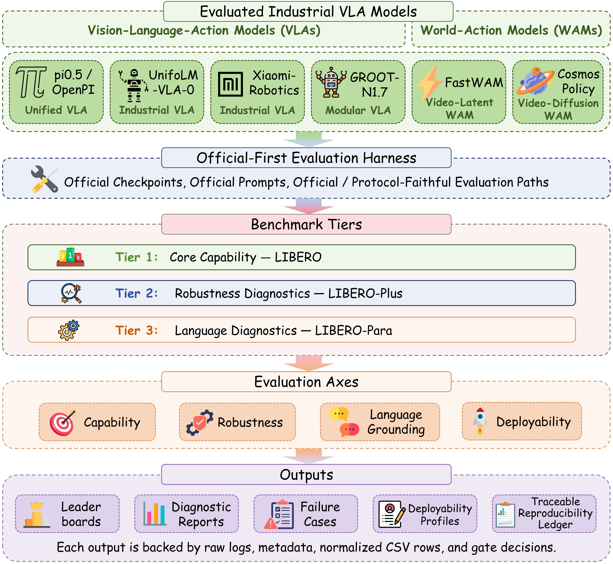

<div align="center">

<h1>IndustrialVLA-Bench</h1>
<h3>A Traceable Multi-Axis Evaluation of Open Robot Policy Models</h3>

<p>
Yiqi Wang<sup>*</sup>, Zhifeng Rao<sup>*</sup>, Jiaqi Zhang, Xiaoyang Li, Zhangkai Wu,<br>
Yiqun Duan, Mingkai Zheng, Fei Wang, Shan You, Taotao Cai
</p>
<p><sup>*</sup>Equal contribution.</p>

<p>
  <a href="https://arxiv.org/abs/2609.25562">
    
  </a>
  
  
  
</p>

<p><i>Comparable, reproducible, and deployment-aware evaluation of open<br>
Vision-Language-Action (VLA) and World-Action Models (WAMs).</i></p>

</div>

---

## News

- **[2026-09]** Paper *"IndustrialVLA-Bench: A Traceable Multi-Axis Evaluation of Open Robot Policy Models"* ([arXiv:2609.25562](https://arxiv.org/abs/2609.25562)).
- **[2026-07]** Reproducible experiment archive released: per-seed results, latency benchmarks, and standardized launch scripts for all six evaluated models.

## Contents

- [Overview](#overview)
- [Why an Official-First Benchmark?](#why-an-official-first-benchmark)
- [Core Concepts](#core-concepts)
- [Evaluated Models](#evaluated-models)
- [Benchmark Tracks](#benchmark-tracks)
- [Results](#results)
- [Deployability and Hardware](#deployability-and-hardware)
- [Getting Started](#getting-started)
- [Repository Structure](#repository-structure)
- [What Is Not Included](#what-is-not-included)
- [Citation](#citation)
- [Acknowledgements](#acknowledgements)
- [Contact](#contact)

## Overview

<div align="center">

<p><i><b>Figure 1.</b> IndustrialVLA-Bench evaluates open robot policy models through an official-first
harness and reports results along capability, robustness, language grounding, and deployability axes,
with traceable evaluation records and metadata.</i></p>
</div>

Open VLA and WAM systems are advancing rapidly, yet their reported results are difficult to compare because checkpoints, evaluation protocols, action interfaces, inference paths, and deployment settings differ across releases.

**IndustrialVLA-Bench** evaluates six publicly executable robot policy models under a unified evaluation protocol:

- **LIBERO** for clean manipulation capability,
- **LIBERO-Plus** for robustness under controlled perturbations,
- **LIBERO-Para** for sensitivity to paraphrased instructions,
- a **deployability harness** for latency, peak VRAM, runtime mode, and execution configuration.

Every model-benchmark configuration uses three fixed run-level seeds `{1, 7, 42}` with the checkpoint and inference configuration held fixed.

Reported uncertainty is the **population standard deviation across the three run-level results**.

## Why an Official-First Benchmark?

**1. Fragmented evaluation.**  
Even within the same benchmark family, results may differ because of checkpoints, prompt formats, observation-action interfaces, action normalization, inference scripts, trial counts, termination rules, and aggregation procedures.

**2. Clean success is not reliability.**  
A model that performs well under standard conditions may still fail under camera, robot, appearance, layout, or instruction shifts. Clean success alone cannot expose these differences.

**3. Deployability is rarely reported consistently.**  
VLA and WAM models operate inside robotic execution loops. Policy-call latency, amortized action latency, peak VRAM, runtime architecture, action chunking, and replanning configuration materially affect practical reuse.

IndustrialVLA-Bench therefore treats robot-policy evaluation as a **multi-axis diagnostic and reproducibility problem**, rather than a single success-rate leaderboard.

## Core Concepts

| Concept | Meaning |
| --- | --- |
| **Official-first execution** | For each model, the official repository, checkpoint, inference path, and evaluation implementation are prioritized. |
| **Protocol-faithful evaluation** | Task definitions, observation/action semantics, success rules, episode horizon, trial counts, and aggregation procedures are preserved. |
| **Three-seed protocol** | Each model-benchmark configuration uses fixed run-level seeds `{1, 7, 42}`. |
| **Run-level uncertainty** | Reported `±` values are population standard deviations across the three run-level results. |
| **Multi-axis profile** | Capability, robustness, language grounding, and deployability are reported separately rather than collapsed into one scalar score. |
| **Traceability** | Results are linked to launch commands, environments, per-seed records, and aggregation rules preserved in the artifact. |

## Evaluated Models

Six publicly executable systems spanning two design families are included.

**All six evaluated systems have completed protocol verification and satisfy the protocol-faithful evaluation checklist.**

| Model | Family | Params | Representative design | LIBERO | LIBERO-Plus | LIBERO-Para |
| --- | :---: | :---: | --- | :---: | :---: | :---: |
| π<sub>0.5</sub> / OpenPI | VLA | 3.6B | Unified single-policy VLA | ✅ | ✅ | ✅ |
| UnifoLM-VLA-0 | VLA | 8.9B | Industrial VLA, model-specific action generation | ✅ | ✅ | ✅ |
| Xiaomi-Robotics-0 | VLA | 4.7B | Industrial VLA, diffusion-based action prediction | ✅ | ✅ | ✅ |
| GR00T-N1.7 | VLA | 3.4B | Modular vision-language + action architecture | ✅ | ✅ | ✅ |
| FastWAM | WAM | 12.4B | Video-latent-conditioned action prediction | ✅ | ✅ | ✅ |
| Cosmos Policy | WAM | 2.0B | Multi-step video-diffusion world-action prediction | ✅ | ✅ | ✅ |

Protocol verification covers checkpoint provenance, task definitions, observation and action semantics, inference configuration, episode termination, success criteria, and aggregation procedures.

## Benchmark Tracks

| Track | Question | Suite | Episodes / seed | Metric |
| --- | --- | --- | :---: | --- |
| Capability | Can the model complete clean manipulation tasks? | LIBERO (Spatial / Object / Goal / Long) | 2,000 (50/task) | Success rate |
| Robustness | Does performance survive visual and embodiment shifts? | LIBERO-Plus | 10,030 | Success rate, drop, retention |
| Language grounding | Does the model follow paraphrased instructions? | LIBERO-Para | 4,092 | Success rate, clean-to-Para drop |
| Deployability | Can the model run practically? | Evaluation harness | — | Policy-call latency, amortized action latency, effective control frequency, peak VRAM |

## Results

All success-rate summaries are based on the three run-level seeds `{1, 7, 42}`.

Where `±` is reported, it denotes the **population standard deviation across the three run-level results**:

\[
\bar{r} = \frac{1}{3}\sum_{i=1}^{3} r_i,
\qquad
\mathrm{Std} =
\sqrt{
\frac{1}{3}
\sum_{i=1}^{3}
(r_i-\bar{r})^2
}.
\]

These deviations describe run-to-run variation under a fixed evaluation configuration set; they are not confidence intervals over task configurations.

### Clean Capability — LIBERO

| Model | Spatial | Object | Goal | Long | **Average** |
| --- | ---: | ---: | ---: | ---: | ---: |
| Xiaomi-Robotics-0 | 98.67 ± 0.09 | 100.00 ± 0.00 | 97.93 ± 0.94 | 95.80 ± 0.91 | **98.10 ± 0.43** |
| UnifoLM-VLA-0 | 98.67 ± 0.66 | 100.00 ± 0.00 | 97.73 ± 0.25 | 95.27 ± 0.41 | **97.92 ± 0.06** |
| GR00T-N1.7 | 97.60 ± 1.50 | 99.30 ± 0.50 | 99.30 ± 0.50 | 95.30 ± 1.00 | **97.88 ± 0.65** |
| Cosmos Policy | 96.40 ± 0.33 | 99.60 ± 0.33 | 97.93 ± 0.34 | 96.60 ± 0.28 | **97.63 ± 0.23** |
| FastWAM | 97.07 ± 0.25 | 99.13 ± 0.09 | 96.47 ± 0.50 | 93.53 ± 0.41 | **96.55 ± 0.16** |
| π<sub>0.5</sub> / OpenPI | 98.33 ± 0.09 | 98.73 ± 0.52 | 97.60 ± 0.43 | 91.40 ± 0.65 | **96.52 ± 0.22** |

<sub>6,000 episodes per model (50 trials/task × 3 seeds). Average is the unweighted mean of the four suite-level success rates.</sub>

### Robustness — LIBERO-Plus

| Model | Camera | Robot | Language | Light | Background | Noise | Layout | **Robust Avg.** | Drop |
| --- | ---: | ---: | ---: | ---: | ---: | ---: | ---: | ---: | ---: |
| π<sub>0.5</sub> / OpenPI | 70.63 | 75.12 | 85.97 | 96.76 | 95.82 | 87.05 | 86.47 | **85.31 ± 0.32** | 11.21 |
| Cosmos Policy | 72.65 | 52.56 | 89.07 | 98.48 | 84.94 | 90.21 | 84.00 | **80.47 ± 0.23** | 17.16 |
| UnifoLM-VLA-0 | 57.03 | 68.37 | 91.09 | 93.70 | 95.14 | 79.26 | 79.19 | **78.78 ± 0.30** | 19.14 |
| GR00T-N1.7 | 64.40 | 38.40 | 83.88 | 94.87 | 93.72 | 84.36 | 74.94 | **75.12 ± 0.28** | 22.76 |
| Xiaomi-Robotics-0 | 40.22 | 55.63 | 89.02 | 94.51 | 90.43 | 86.78 | 75.87 | **73.91 ± 0.13** | 24.19 |
| FastWAM | 44.65 | 72.04 | 66.99 | 94.22 | 66.57 | 67.17 | 79.45 | **70.69 ± 0.52** | 25.86 |

<sub>Robust Avg. is the unweighted mean over the six non-linguistic perturbation dimensions. The LIBERO-Plus language condition is shown separately and excluded from Robust Avg.</sub>

### Language Grounding — LIBERO-Para

| Model | Para success (%) | Clean-to-Para drop (pp) |
| --- | ---: | ---: |
| UnifoLM-VLA-0 | **82.24 ± 0.48** | 15.67 ± 0.53 |
| Xiaomi-Robotics-0 | **75.73 ± 0.16** | 22.37 ± 0.48 |
| GR00T-N1.7 | **74.26 ± 1.52** | 23.62 ± 1.52 |
| π<sub>0.5</sub> / OpenPI | **71.33 ± 0.05** | **25.19 ± 0.18** |
| Cosmos Policy | **70.50 ± 0.26** | 27.13 ± 0.18 |
| FastWAM | **51.16 ± 0.38** | 45.39 ± 0.32 |

<sub>The same checkpoints are used for clean LIBERO and LIBERO-Para evaluation; no model is adapted or fine-tuned on LIBERO-Para.</sub>

### Key Findings

1. **Clean LIBERO is close to saturation** — averages span only **1.58 pp** (96.52–98.10%).
2. **Robustness separates models substantially more strongly** — LIBERO-Plus robustness spans **14.62 pp**.
3. **Language sensitivity is even more discriminative** — LIBERO-Para spans **31.08 pp**.
4. **Clean ranking does not predict robustness** — the highest clean score does not correspond to the strongest perturbation robustness.
5. **Language sensitivity is partially decoupled from clean capability** — models with similar clean scores can diverge sharply under paraphrases.
6. **All six systems satisfy the same protocol-verification criteria**, enabling direct comparison under the benchmark's evidence framework.

## Deployability and Hardware

All six models were measured on a **single MetaX C500 GPU with batch size 1**.

Because dtype, action chunk length, and replanning configuration differ across models, these measurements are **observational deployment profiles**, not a controlled intrinsic-efficiency ranking.

| Model | Device | Peak VRAM | Dtype | Batch size | Action chunk | Replan / open-loop steps | Latency / call | Amortized policy latency / action | Effective control frequency |
| --- | --- | ---: | --- | ---: | ---: | ---: | ---: | ---: | ---: |
| GR00T N1.7 | MetaX C500 | 7,810 MiB | BF16 | 1 | 16 | 8 | 153.03 ms | 19.13 ms | 52.3 Hz |
| Cosmos Policy | MetaX C500 | 8,654 MiB | BF16 autocast | 1 | 16 | 16 | 340.16 ms | 21.26 ms | 47.0 Hz |
| Xiaomi-Robotics-0 | MetaX C500 | 10,294 MiB | BF16 | 1 | 10 | 10 | 254.35 ms | 25.43 ms | 39.3 Hz |
| OpenPI π0.5 | MetaX C500 | 14,550 MiB | BF16 | 1 | 10 | 5 | 294.02 ms | 58.80 ms | 17.0 Hz |
| UnifoLM-VLA-0 | MetaX C500 | 18,332 MiB | BF16/FP32 mixed | 1 | 8 | 8 | 158.54 ms | 19.82 ms | 50.5 Hz |
| FastWAM | MetaX C500 | 26,902 MiB | BF16 | 1 | 32 | 10 | 453.33 ms | 45.33 ms | 22.1 Hz |

### Latency Definitions

- **Latency / call**: wall-clock latency of one policy invocation.
- **Amortized policy latency / action**: policy-call latency divided by the number of actions executed before replanning.
- **Effective control frequency**: inverse of the amortized policy-side latency per executed action.

Peak VRAM is measured with `nvidia-smi` during evaluation-time inference after warm-up. Environment reset time is excluded.

### Runtime Summary

| Model | Params | Runtime mode |
| --- | ---: | --- |
| GR00T-N1.7 | 3.4B | Deployment-oriented |
| Cosmos Policy | 2.0B | Deployment-oriented |
| Xiaomi-Robotics-0 | 4.7B | Model-specific |
| π<sub>0.5</sub> / OpenPI | 3.6B | Local / server-client |
| UnifoLM-VLA-0 | 8.9B | Local / model-specific |
| FastWAM | 12.4B | Deployment-oriented |

## Getting Started

This repository is a **reproducible experiment archive**.

### 1. Install benchmark environments

```bash
bash envs/libero/install.sh
bash envs/libero-plus/install.sh
bash envs/libero-para/install.sh
